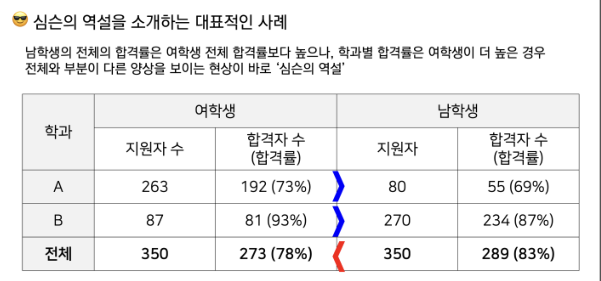
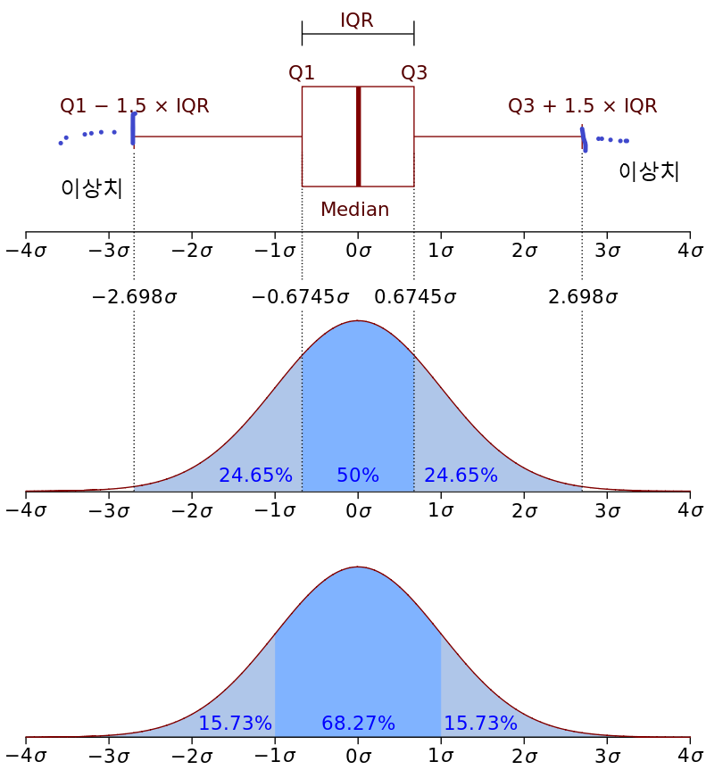
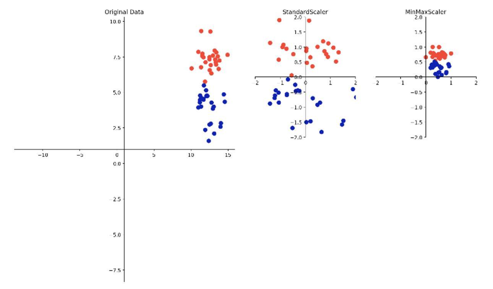
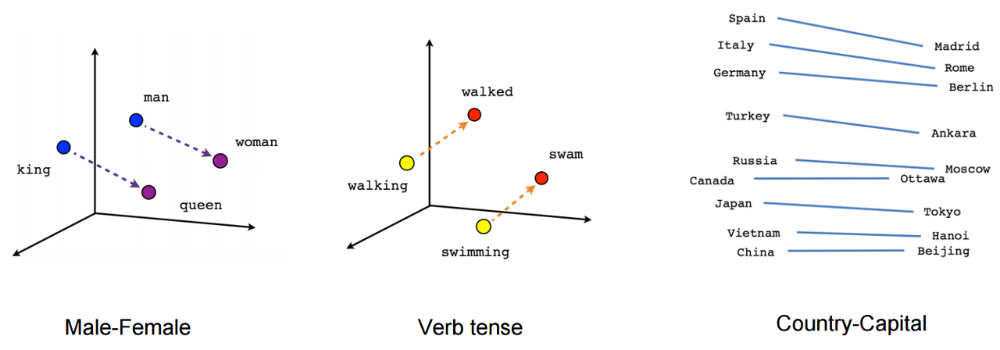

## 데이터 전처리

### 변수 선택

**범주형 변수 선택의 중요성**
- 심슨의 역설은 데이터의 세부 그룹별로 일정한 추세나 경향성이 나타나지만, 전체적으로 보면 그 추세가 사라지거나 반대 방향의 경향성을 나타내는 현상
- 이 현상은 사회과학이나 의학 통계 연구에서 종종 발생함
- 데이터 해석의 왜곡을 가져올 수 있기 때문에 범주형 변수 선택이 중요함

군집(A학과, B학과)별로 경쟁률을 고려하지 않았기 때문에 심슨의 역설 발생




---

### 정형 데이터 전처리

**자료구조 패키지: pandas, numpy**

| 패키지  | 자료구조 | 설명 |
|---------|----------|------|
| **pandas** | DataFrame | 행과 열로 구성된 2차원 구조, **열마다 다른 데이터 타입** 가능 |
| **numpy**  | vector (1차원), matrix (2차원) | 모든 원소가 **동일한 데이터 타입**을 가져야 함 |


**DataFrame vs Matrix**

| 항목       | DataFrame (`pandas`)         | Matrix (`numpy`)             |
|------------|-------------------------------|-------------------------------|
| 형태       | 2차원 (행, 열)               | 2차원 (행, 열)               |
| 데이터 타입 | 열마다 다를 수 있음            | 전체가 동일한 타입이어야 함   |
| 인덱싱     | 라벨 기반 (`loc`, `iloc`)     | 정수 기반 인덱싱만 가능       |
| 유연성     | 더 높은 유연성과 기능 제공     | 연산 속도에 최적화된 구조     |


cf. array 차원 별 명칭

| array 구분 | 명칭     | 관련 패키지 예시 |
|------------|----------|------------------|
| 0차원      | scalar   | Python 기본 타입 (`int`, `float`) |
| 1차원      | vector   | NumPy (`np.array([1, 2, 3])`), Pandas Series (`pd.Series([...])`) |
| 2차원      | matrix   | NumPy (`np.array([[1,2],[3,4]])`), Pandas DataFrame (`pd.DataFrame(...)`) |
| 3차원 이상 | tensor   | TensorFlow (`tf.constant(...)`), PyTorch (`torch.tensor(...)`) |


---

**결측치 처리 방법**
- 결측치가 발생한 데이터 셋을 버리기 (행 삭제)
- 대표값(평균/중앙값 등)이나 예측값으로 채워넣기

**이상치 찾는 방법**
- boxplot
- 정규분포 기반 판단



---

**예제 노트북**
- dataframe
  - [데이터프레임생성_데이터추출](ex01_pandas_데이터프레임생성_데이터추출.ipynb)
  - [결측치처리](ex02_pandas_결측치처리.ipynb)
  - [이상치처리](ex03_pandas_이상치처리예.ipynb)
  - [병합](ex04_pandas_병합.ipynb)
- numpy
  - [numpy 활용](ex05_Numpy.ipynb)

---

### 수치형 데이터 전처리

**수치형 데이터의 정규화 이유**
- 큰 수를 가지고 있는 데이터가 전체적인 해석에 영향을 많이 미침
- 집단 내의 상대적인 위치 파악에 도움
- 머신러닝에서 많은 양의 데이터를 학습할 때 계산 부하를 줄이기 위해서

정규화는 자주 쓰이지만, 표준화는 상황에 따라 선택적으로 사용됨

- **MinMaxScaler**: 값의 범위를 0~1 사이로 변환 (정규화)
- **StandardScaler**: 평균을 0, 표준편차를 1로 맞춤 (표준화)  
  → 최솟값/최댓값의 스케일 제약은 없음



---

### 범주형 데이터 전처리

**원핫인코딩**

범주형변수를 학습하기 위해서 PC가 처리할 수 있도록 숫자코드를 부여시켜야 함

`red=1, blue=2, yellow=3`  
→ ML에서는 연속형 자료로 해석되어 퍼포먼스 저하

One hot encoding을 통해 범주형 변수 간의 순서/크기 관계를 제거할 수 있음

```
red =    1 0 0
blue =   0 1 0
yellow = 0 0 1
```

---

### 자연어 데이터 전처리

**자연어 처리 단계**

1. 자연어를 token 형태로 나누기
2. 단어 인덱스: 딕셔너리 만들기
3. 표현
   - one hot encoding
   - word embedding, word vector

**One hot encoding**
- 단어별 인덱스를 기반으로 벡터 생성
- 단점: 벡터가 희소하고 순서, 의미를 표현할 수 없음

**단어 임베딩**
- 단어의 의미적 유사성을 반영한 벡터화
- 컴퓨터가 자연어 단어의 의미를 "기하학적 공간"으로 이해하게 하는 방식
- Word2Vec 등 임베딩 알고리즘 사용



**Word2Vec 모델 구조**
- `wiki.model`: 전체 학습된 Word2Vec 모델
- `wiki.model.wv.syn0.npy`: 단어 벡터(입력)
- `wiki.model.syn1neg.npy`: 출력 벡터 (negative sampling 용)

**실습 노트북**
- [딕셔너리 만들기](nlp/nlp_ex01_dic.ipynb)
- [One-hot 인코딩](nlp/nlp_ex03_one_hot.ipynb)
- [영화리뷰 분류 예제](nlp/nlp_ex04_one_hot_영화리뷰_분류.ipynb)
- [Word2Vec 사전 구축](nlp/nlp_ex05_wiki-mkdic.ipynb)
- [단어 간 연산](nlp/nlp_ex06_word_calculate.ipynb)

**Reference**
- [word2vec document](https://www.tensorflow.org/tutorials/representation/word2vec)
- [국립국어원 말뭉치 자료](https://corpus.korean.go.kr/request/reausetMain.do?lang=ko)
- [위키피디아(한국어판) 말뭉치 자료](https://dumps.wikimedia.org/kowiki/latest/)


